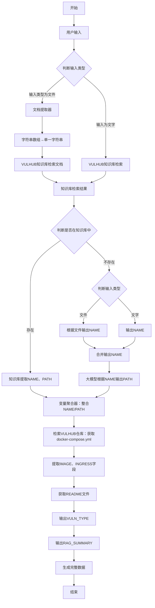

# 2026-01-15 组会周报

## TODO

- 集成 MCP tools
- 分享：当前工作框架和流程，数据如何产生/哪些部分可以写成代码，什么时间写什么部分/评估数据
- 挂图作战、框架、路线
- 周报做成模板
- 写论文，不要中文（英文），绝对不要凭空编造参考文献

## 半自动生成100个数据

1. 在 vulhub 中找 10 种以上类型的漏洞，`test_100.csv`记录漏洞编号和对应的漏洞类型。
2. `test_100.json`：在trae中按照所给样例 `sample.json` ，在当前 vulhub 仓库文件查找 CVE-年份-编号，参考它的 `docker-compose.yml` 文件和 `README.zh-cn.md`文件，并根据 `模板.md` 中 rag_summary 字段的编写方式补全数据结构。
3. 一次生成20条数据。

## 搭建工作流



### 待解决

- 调用网页版vulhub，受网络不稳定影响
- 一次只能输入一个漏洞名称，输入多个会默认生成最后一个
- 文件输入也是只能识别并生成一个漏洞的数据
- 未找到靶标名称直接结束生成

## pipeline调用大模型实现数据标注

### 提示词

```
1. 用户输入文字（一个或者多个漏洞数字编号），用户输入文件，则提取文件中的文字（一个或者多个漏洞数字编号）。

2. 漏洞编号在知识库中分别进行检索，如果在知识库中有对应，则输出漏洞编号和漏洞路径，利用漏洞路径在vulhub仓库 里读取对应漏洞的`docker-compose.yml`文件，获得image和ingress字段，再读取`README.zh-cn.md`文件，调用大模型根据`README.zh-cn.md`文件输出vuln_type和rag_summary字段，rag_summary字段参考`模板.md` 。

3. 如果在知识库中没有对应漏洞编号，则调用大模型搜索漏洞编号，并生成其他字段，rag_summary字段参考`模板.md` ，大模型搜索不到则输出“未匹配到有效漏洞名称”，严禁任何猜测、杜撰、拼凑。

4. 输出存放在output目录下，输出数据格式样例为`sample.json`
```

### 优化后靶标数据自动化标注流程提示词

``` 
一、 输入处理阶段 
 
 1. 支持双输入模式，精准提取漏洞编号 

    - 文字输入：用户直接录入单个/多个漏洞数字编号，自动过滤非数字字符、空值，完成去重处理，生成有效漏洞编号列表； 

    - 文件输入：用户上传.txt/.csv文件，自动读取文件文本内容，提取其中所有纯数字漏洞编号，完成格式校验、去重，过滤无效字符与重复编号，生成有效漏洞编号列表； 

 2. 输入兜底校验：文件输入需校验文件存在性、可读性及编码兼容性，非文本文件直接判定无效输入，全程确保输入的漏洞编号为合规格式。 
 
二、 漏洞信息检索与标准化字段生成阶段 
 
 对有效漏洞编号列表中的每个编号，逐一执行独立检索与字段生成流程，全程严禁猜测、杜撰、拼凑任何信息 
 
场景1：知识库检索匹配成功 
 
 1. 漏洞编号在知识库中检索到对应记录，提取核心关联字段：漏洞编号（name）、漏洞在vulhub中的相对路径（path）； 

 2. 路径关联vulhub仓库：基于提取的path，定位至vulhub指定目录（`c:\Users\86199\Desktop\EpicCyberRange\vulhub\`）下对应漏洞文件夹； 

 3. 读取解析 `docker-compose.yml`文件：精准提取 `image`字段（对应数据格式中image字段），提取ports字段（转换为数组格式，对应contracts.ingress字段，无该字段则标注为空数组）； 

 4. 读取 `README.zh-cn.md`文件：完整提取文件内漏洞相关核心信息（受影响组件、版本、利用条件、触发路径等）； 

 5. 大模型生成标准化字段：调用大模型，以README.zh-cn.md内容为输入，严格遵循指定要求生成2个核心字段 
 
    - 生成 `contracts.vuln_type`字段：明确漏洞类型，在config.json中规定；

    - 生成 `rag_summary`字段：严格贴合给定核心要素与固定模板生成

       - 核心要素：漏洞标识（CVE 编号）、受影响组件（软件 / 框架及版本）、漏洞类型（如认证绕过、XSS、SSRF 等）、利用前置条件（是否认证、特定配置 / 权限、核心利用操作（关键步骤 + 技术细节 + 触发点）、危害效果（直接危害 + 间接危害 + 影响范围）、环境信息（镜像 + 端口）。

       - 模板：“漏洞 {CVE编号} 是 {受影响组件} 中的 {漏洞类型} 漏洞。该漏洞需满足 {利用前置条件}，攻击者可通过 {关键操作步骤}，构造 {技术细节描述} 的恶意内容发送至 {触发点} 触发漏洞；利用成功后可直接导致 {直接危害描述}，进而可能 {间接危害描述}，对 {影响范围} 造成严重威胁。对应的环境镜像为 {镜像名称}，默认运行在 {端口} 端口。” 

 6. 字段整合：归集所有字段，确保与目标数据格式完全对齐。例如： 
 { 
   "rag_summary": "漏洞 CVE-2024-39907 是 1Panel 控制面板中的 SQL 注入漏洞。该漏洞需满足已完成 1Panel 控制面板认证的前置条件，攻击者可通过向指定接口参数注入恶意 SQL 语句的关键操作，构造包含 SQLite ATTACH DATABASE 操作（如 “3;ATTACH DATABASE '/tmp/pwn.txt' AS pwn;”）的恶意内容发送至 /api/v1/hosts/command/search 接口的 orderBy 参数触发漏洞；利用成功后可直接导致在目标 1Panel 服务器上执行任意代码，进而可能完全控制目标系统，对服务器权限、数据安全性造成严重威胁。对应的环境镜像为 vulhub/1panel/CVE-2024-39907，默认运行在 10086 端口。", 
   "name": "CVE-2024-39907", 
   "path": "1panel/CVE-2024-39907", 
   "image": "vulhub/1panel:1.10.10", 
   "contracts": { 
     "ingress": [10086], 
     "vuln_type": "sql_injection" 
   } 
 } 
 
场景2：知识库检索匹配失败 
 
 1. 漏洞编号在知识库中无对应记录，调用大模型以该漏洞编号为核心关键词进行精准检索； 

 2. 大模型检索结果判定： 

    - 检索到有效漏洞信息：按目标数据格式要求，生成全量字段（name、path、image、contracts（ingress、vuln_type）、rag_summary），其中rag_summary严格遵循给定核心要素与固定模板生成，无明确信息的字段标注为null； 

    - 未检索到有效漏洞信息：直接标注rag_summary为“未匹配到有效漏洞名称”，其余所有字段标注为null，全程杜绝杜撰信息。 
 
三、 结果输出与存储阶段 
 
 1. 数据格式校验：所有生成的漏洞标注数据，均需严格匹配指定JSON样例格式，字段名、字段层级、数据类型完全统一（name为字符串、path为字符串、image为字符串、contracts为嵌套对象、ingress为数组、vuln_type为字符串、rag_summary为符合模板的字符串）； 

 2. 输出目录处理：自动检测output目录是否存在，不存在则自动创建，避免存储报错； 

 3. 文件存储规范：将标注数据写入JSON文件，存储路径统一放入output目录，文件名直接使用漏洞编号，即name字段，支持批量编号合并存储或单编号独立存储，避免文件名重复覆盖；

 4. 存储容错：处理文件读写权限异常、路径不存在等问题，确保标注结果稳定落地。
```